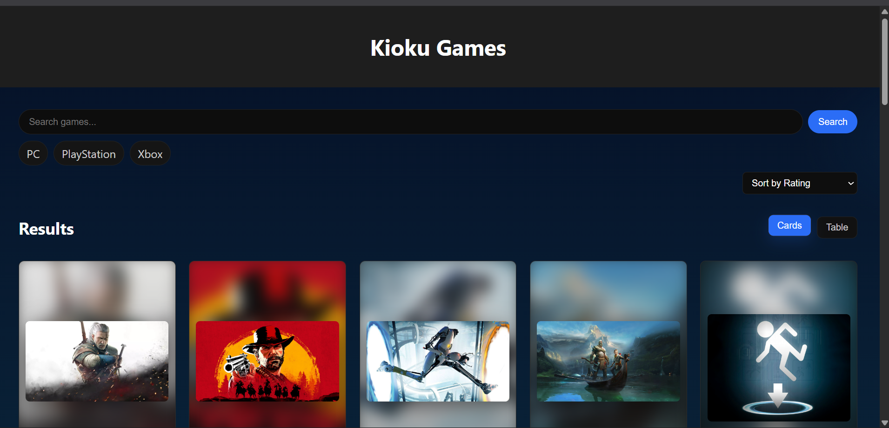
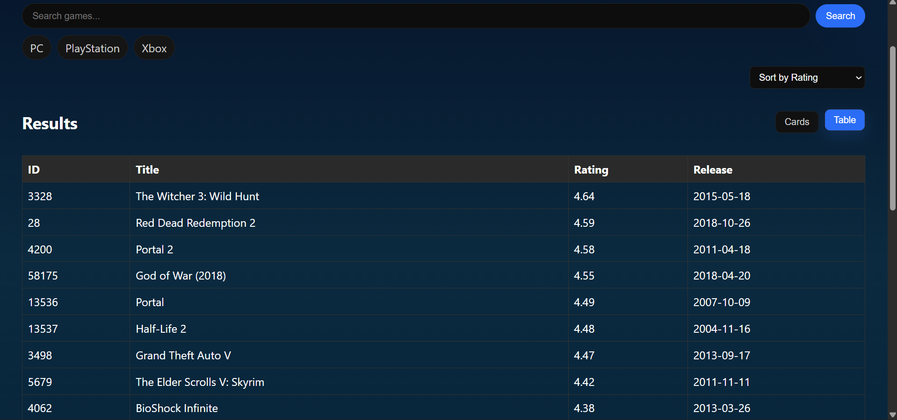
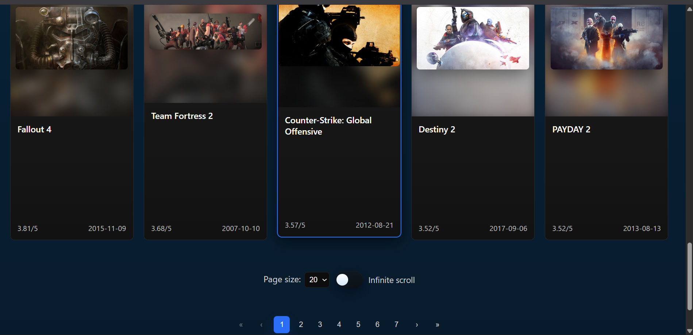

## Kioku Games

Website: https://utspemweb123140155kiokugames.vercel.app/

Kioku Games is a React + Vite application that browses game data from the RAWG API and presents a modern, responsive card grid with search, filters, detail modals and a screenshot carousel.

---

## Installation (React & Vite)

Prerequisites:
- Node.js (LTS recommended, >=16)
- npm (comes with Node) or yarn/pnpm

1. Clone the repository and open a terminal into the project folder:

```powershell
git clone <repo-url>
cd "UTS_Ahmad Ali Mukti_123140155"
```

2. Install dependencies:

```powershell
npm install
# or with pnpm: pnpm install
# or with yarn: yarn
```

3. Create a `.env` file in the project root with your RAWG API key (example):

```
VITE_RAWG_API_KEY=your_rawg_api_key_here
VITE_API_BASE_URL=https://api.rawg.io/api
```

4. Start the dev server:

```powershell
npm run dev
```

5. Build for production and preview the build:

```powershell
npm run build
npm run preview
```

---

## Screenshots


Tampilan Desktop:



Tampilan Mobile:


Tampilan tabel:



Tampilan footer:


---

## Project structure

```
UTS_Ahmad Ali Mukti_123140155/
├─ index.html
├─ package.json
├─ vite.config.js
├─ .env (not committed)
├─ README.md (original template)
├─ README_PROJECT.md (this file)
├─ ss.doc
├─ src/
│  ├─ main.jsx
│  ├─ App.jsx
│  ├─ App.css
│  ├─ assets/
│  ├─ components/
│  │  ├─ GameGrid.jsx
│  │  ├─ GameDetail.jsx
│  │  └─ SearchForm.jsx
│  └─ constants/
│     └─ api.js
└─ node_modules/
```

---

## Usage

- Open the dev server URL shown by Vite (usually http://localhost:5173) in your browser.
- Use the search bar and filters to find games.
- Click a card to open the detail modal with carousel and screenshots.

---

## Student Info

| Nama | NIM | Kelas |
|------|-----:|:-----:|
| Ahmad Ali Mukti | 123140155 | RA |

---

If you'd like this content moved into the original `README.md` or prefer embedded images (PNG/JPG) instead of a `.doc`, tell me and I will update the repository files accordingly.
